# Blockchain
## Algoritmos y Estructuras de Datos - 2022 - 2

## Autores

|                     **Joaquín Jordán**                   |                             **Renato Cernades**                                                        |                       **José Chachi**                     |  
|:---------------------------------------------------------------------------------:|:------------------------------------------------------------------------------------------------------------------------------:|:-----------------------------------------------------------------------------------:|
|                       |                                                                     |                            |                                              
| <a href="https://github.com/jjordanoc" target="_blank">`github.com/jjordanoc`</a> |                <a href="https://github.com/RenatoCernades0107" target="_blank">`github.com/RenatoCernades`</a>                 | <a href="https://github.com/JoseChachi" target="_blank">`github.com/JoseChachi`</a> |

## Introducción

En el presente proyecto se implementó el gestor de transacciones BlockDB basado en Blockchain. Este permite realizar operaciones de inserción, modificación y búsqueda de transacciones bancarias. Para esto, se implementó una estructura de Blockchain basada en una lista circular  doblemente enlazada que soporta diferentes dominios de datos.

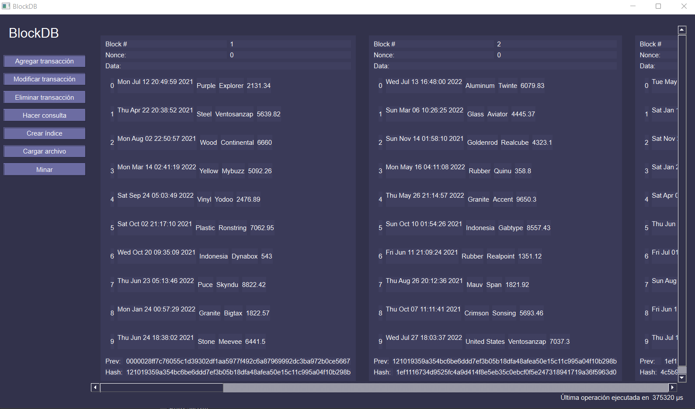    

## Objetivos

- Objetivo principal: Implementar un sistema gestor de transacciones basado en Blockchain que soporte consultas eficientes, indexando los valores por medio de estructuras de datos.
- Objetivos específicos:
  - Implementar la estructura de Blockchain.
  - Elaborar una interfaz gráfica para interactuar con la estructura.
  - Indexar las transacciones con una estructura de datos.

## Descripción del caso de estudio planteado por el grupo

En un sistema bancario, se necesita guardar registros a una base de datos donde cada uno simula una transacción. Esta comprende información del emisor, receptor, monto y fecha de la transacción realizada. Se estudiarán las transacciones de un banco ficticio que maneja un Blockchain local con la finalidad de asegurar sus datos. Además, se realizarán consultas con respecto a los atributos de los datos almacenados.

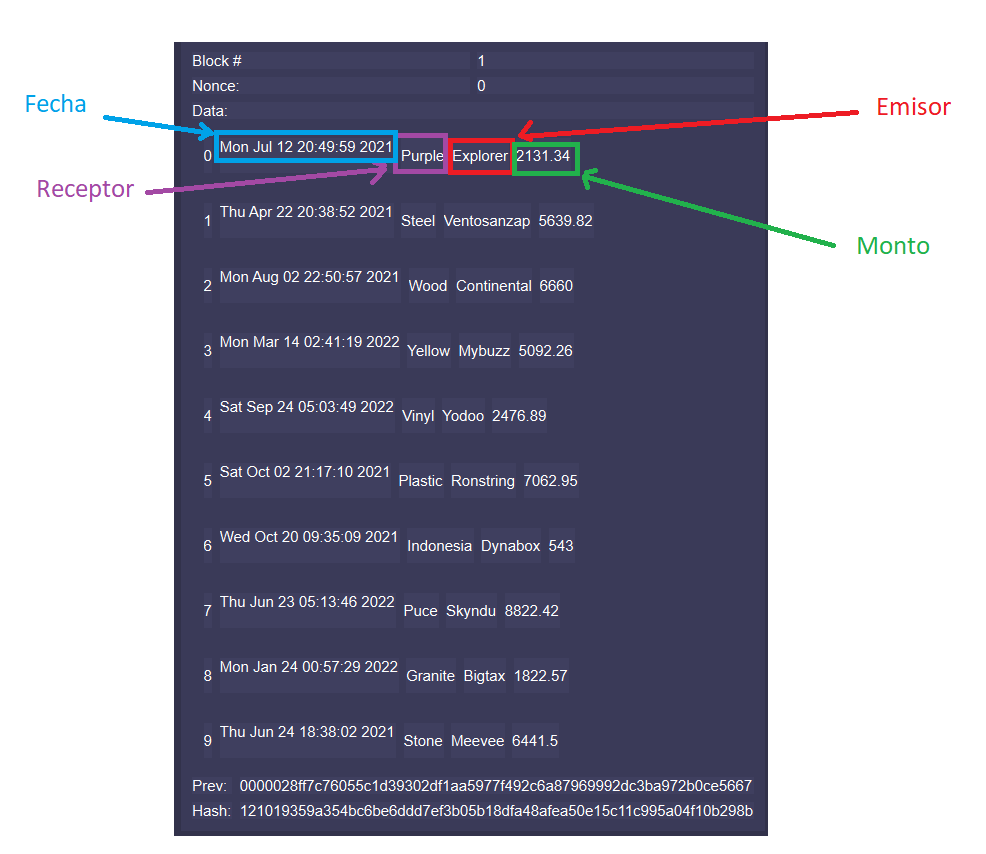

## Importancia del Blockchain en el dominio de datos elegido

Blockchain es un libro compartido e inmutable que facilita el proceso de  guardar transacciones y rastrear activos tanto tangibles como intangibles en una red de negocios. Practicamente todo puede ser rastreado y comercializado en una red de Blockchain, reduciendo el riesgo y disminuyendo el costo para todos los actores [3]. El Blockchain surge en el año 2008 con el objetivo de servir como un registro de contabilidad distribuido y seguro para la criptomoneda Bitcoin. Es así que el Blockchain desde sus orígenes está pensado para servir en aplicaciones financieras.

|  |
|:------------------------------------------------------------------------:|
| *Figura 1: Representación gráfica de la estructura de datos Blockchain*  |

## Estructura del Blockchain

Para la implementación del Blockchain se decidió utilizar una lista circular doblemente enlazada con centinela [1].

|                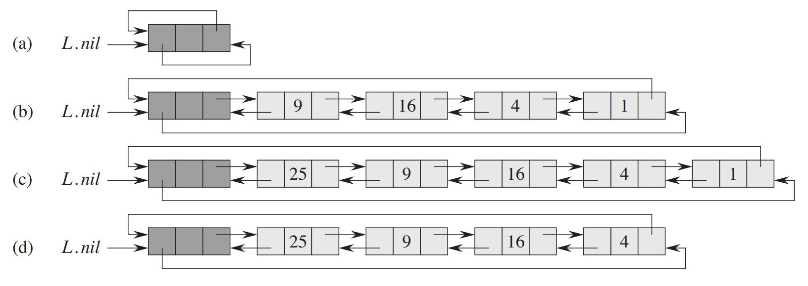                |
|:--------------------------------------------------------------------------------------:|
| *Figura 2: Lista doblemente enlazada con nodo centinela. L.nil es el nodo centinela. Imagen extraída de [1]* |

Esta lista está compuesta por estructuras llamadas bloques, que son arreglos de tamaño fijo. Además, cuentan con un puntero a su propio código hash y un puntero al código hash del bloque anterior, de tal manera que, al alterarse el código hash del bloque anterior, esta actualización se ve reflejada también en el bloque actual.
Los bloques tambien cuentan con un id, un entero positivo que indica el orden cronológico del bloque creado, y un nonce.
La integridad del contenido del Blockchain está garantizada por los métodos limitados que contamos para interactuar con la estructura: ``insertEntry``, ``hackEntry``, `searchEntry`, ``isValid`` y ``validate``. Las operaciones realizadas sobre el Blockchain pueden invalidarlo; sin embargo, se puede verificar la validez del Blockchain y validarlo, minando los bloques que haga falta.

|                                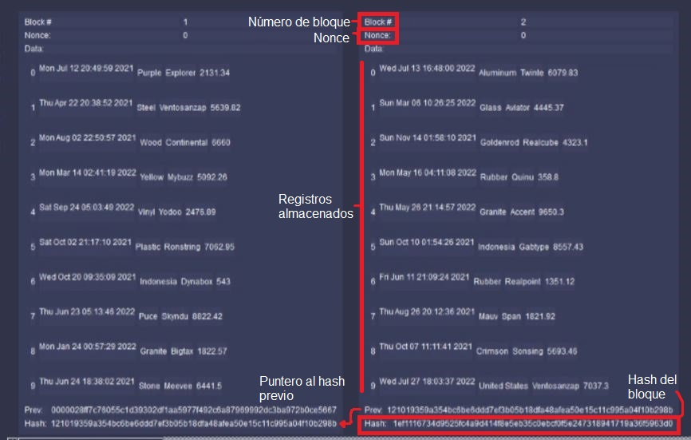                                 |
|:--------------------------------------------------------------------------------------------:|
| *Figura 3: Dos bloques adjuntos en un Blockchain sin minar. El número de registros es de 10* |
### Proof of work
El nonce se calcula al momento de minar el bloque como el menor entero positivo que produce por lo menos cuatro ceros al inicio del hash. Esta es la técnica de _proof of work_ que se implementó en el Blockchain.

|                      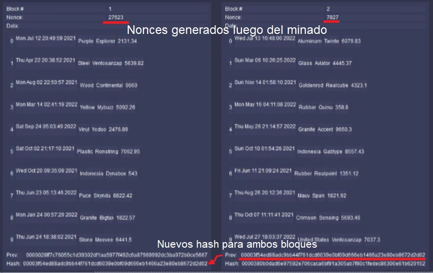                      |
|:-----------------------------------------------------------------------:|
| *Figura 4: Dos bloques adjuntos en un Blockchain luego de ser minados.* |
## Estructuras de datos para la indexación

Para optimizar las consultas hechas sobre el Blockchain se implementaron diferentes estructuras para indexar las entradas bajo algún atributo dado. En el caso de atributos no únicos, se utilizó agrupamiento. El usuario del gestor BlockDB debe crear los índices respectivos de acuerdo a las consultas que planea hacer con mayor frecuencia.

A continuación se detallan las estructuras de datos usadas, comparando la complejidad promedio de cada operación con la de la búsqueda lineal sobre todas las n entradas. Cuando el índice no se encuentra disponible o es irrelevante, se emplea el procedimiento de filtrado lineal, cuya tabla de complejidades se muestra a continuación.

|       **Tipo de consulta**      | **Igual a X** | **Entre X y Y** | **Inicia con X** | **Está contenido en X** | **Máximo valor** | **Mínimo valor** |
|:-------------------------------:|:-------------:|:---------------:|:----------------:|:-----------------------:|:----------------:|:----------------:|
| **Complejidad (caso promedio)** |      O(n)     |       O(n)      |       O(n*w)       |           O(n*w*p)          |       O(n)       |       O(n)       |

p es el tamaño de X (generalmente menor que w) y w es el tamaño promedio de las cadenas del atributo.

### Heap

En primer lugar, se implementó la indexación con Heap (max y min heap) para hallar en tiempo constante el valor máximo o mínimo del atributo deseado. Esta estructura puede ser visualizada como un árbol completo o como un arreglo y sigue un criterio de comparación para ordenar sus elementos.
Siempre actualiza sus elementos a como se inserten o eliminen si es necesario para seguir la consistencia de la estructura. [1]

|                                                              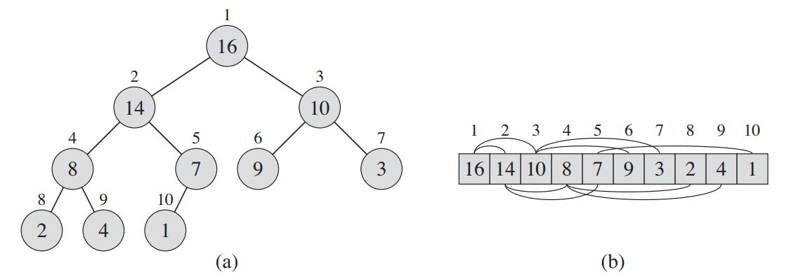                                                              |
|:--------------------------------------------------------------------------------------------------------------------------------------------------:|
| *Figura 5: Representación gráfica de un Max-heap. (a) es en forma de árbol, mientras que (b) mantiene un forma de arreglo. Imagen extraída de [1]* |

|       **Tipo de consulta**      | **Igual a X** | **Entre X y Y** | **Inicia con X** | **Está contenido en X** | **Máximo valor** | **Mínimo valor** |
|:-------------------------------:|:-------------:|:---------------:|:----------------:|:-----------------------:|:----------------:|:----------------:|
| **Complejidad (caso promedio)** |      O(n)     |       O(n)      |       O(n*w)       |           O(n*w*p)          |      O(1) (max-heap)       |      O(1)  (min-heap)       |

### Hash

En segundo lugar, se implementó la indexación con Hash para optimizar las consultas por igualdad sobre algún atributo. Esta estructura es empleada para simular un diccionario en donde las operaciones más utilizadas son las inserciones, búsquedas y eliminaciones. La forma de guardar los elementos son variadas, pero en esta oportunidad se tomará el chaining.
Este método nos ayuda a evitar colisiones dentro de la misma estructura. Esto es gracias debido a que se manejan listas dentro de la estructura. [1]

|                                                                   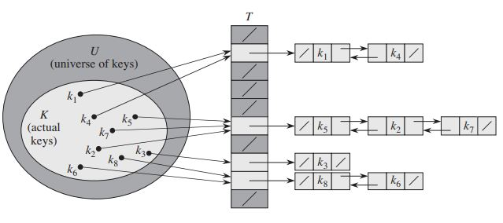                                                                   |
|:------------------------------------------------------------------------------------------------------------------------------------------------------------:|
| *Figura 6: Representación gráfica de un hash con chaining. Se está empleando listas doblemente enlazadas como estructura de soporte. Imagen extraída de [1]* |

|       **Tipo de consulta**      | **Igual a X** | **Entre X y Y** | **Inicia con X** | **Está contenido en X** | **Máximo valor** | **Mínimo valor** |
|:-------------------------------:|:-------------:|:---------------:|:----------------:|:-----------------------:|:----------------:|:----------------:|
| **Complejidad (caso promedio)** |      O(1)     |       O(n)      |       O(n*w)       |           O(n*w*p)          |       O(n)       |       O(n)       |

### BST (AVL)

En tercer lugar, se implementó la indexación con AVL para optimizar las consultas por igualdad y por rango. Esta estructura sigue las propiedades de un BST solo que mantiene su estructura balanceada mediante métodos llamados rotaciones. Estas rotaciones son efectuadas debido a un criterio de balanceo que está definido por las alturas del subárbol izquierdo y derecho por cada nodo [1]. 
La optimización lograda para consultas por rango existe pero es limitada, y se considera preferible utilizar un B+Tree. 

|                                        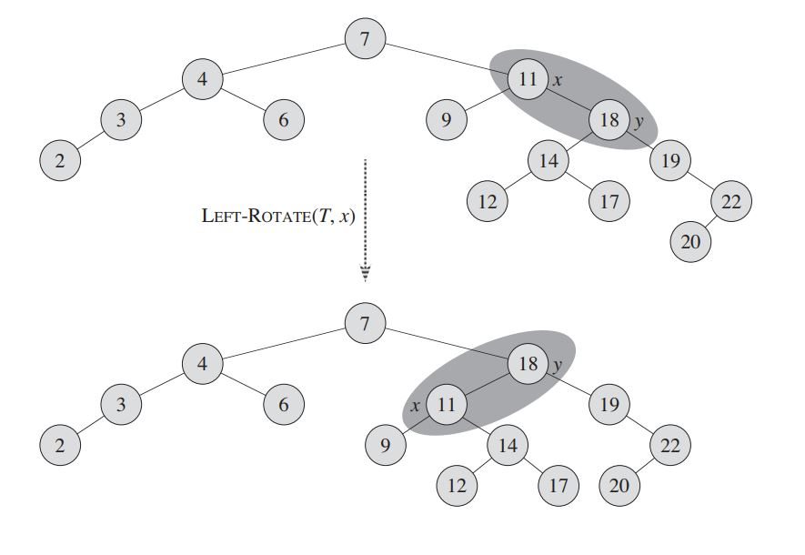                                        |
|:----------------------------------------------------------------------------------------------------:|
| *Figura 7: Demostración de una rotación hacia la izquierda dentro de un AVL. Imagén extraída de [1]* |

|       **Tipo de consulta**      | **Igual a X** | **Entre X y Y** | **Inicia con X** | **Está contenido en X** | **Máximo valor** | **Mínimo valor** |
|:-------------------------------:|:-------------:|:---------------:|:----------------:|:-----------------------:|:----------------:|:----------------:|
| **Complejidad (caso promedio)** |      O(logn)    |       O(n)      |       O(n*w)       |           O(n*w*p)          |       O(logn)       |        O(logn)       |

### Trie (Patricia Trie)

Finalmente, se implementó la indexación con Trie para optimizar las consultas sobre cadenas de caracteres. Esta estructura es una estructura optimizada en complejidad espacial debido a que es un trie compactado. Su aplicación es sobre cadenas de caracteres en donde agrupa la palabra por partes. El uso de un patricia trie es debido a que la búsqueda es más rápida.

|                                                                     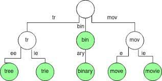                                                                      |
|:-----------------------------------------------------------------------------------------------------------------------------------------------------------------:|
| *Figura 8: Un Patricia Trie almacenando distintas palabras. Los nodos en color verde indican el término de una palabra, es decir, una palabra en el diccionario.* |

|       **Tipo de consulta**      | **Igual a X** | **Entre X y Y** | **Inicia con X** | **Está contenido en X** | **Máximo valor** | **Mínimo valor** |
|:-------------------------------:|:-------------:|:---------------:|:----------------:|:-----------------------:|:----------------:|:----------------:|
| **Complejidad (caso promedio)** |      O(w)     |       O(n)      |       O(w)       |           O(n*w*p)          |       O(n)       |       O(n)       |

### Tabla comparación de tiempos en microsegundos (sin índices)

| Comparación | Igual | Mínimo | Máximo | Contiene | Inicia con | Entre |
|:-----------:|:-----:|:------:|:------:|:--------:|:----------:|:-----:|
|   Emisor    | 5129  |  157   |  172   |   7138   |    5562    |   X   |
|  Receptor   | 5387  |  156   |  177   |   7047   |    6360    |   X   |
|    Monto    |  524  |  168   |  136   |    X     |     X      |  823  |
|    Fecha    |  177  |  135   |  156   |    X     |     X      |  165  |

### Tabla comparación de tiempos en microsegundos (con índices)

Para cada caso se ha decidido crear un índice con la estructura que soporta la operación en el mejor tiempo computacional. En el caso de igual se ha decidido usar un Hash; mínimo y máximo, un heap; inicia con, un Patricia trie; entre, un AVL.

| Comparación | Igual | Mínimo | Máximo | Contiene | Inicia con | Entre |
|:-----------:|:-----:|:------:|:------:|:--------:|:----------:|:-----:|
|    Emisor   |   10  |    5   |    5   |     X    |     19     |   X   |
|   Receptor  |   11  |    5   |    6   |     X    |     16     |   X   |
|    Monto    |   27  |    6   |    4   |     X    |      X     |  105  |
|    Fecha    |   ?   |    6   |    5   |     X    |      X     |   14  |

## Análisis de la complejidad de los métodos del Blockchain

- ``void insertEntry(Entry *entry)``: Inserta un nuevo registro al último bloque disponible en el Blockchain. Si el último bloque está lleno, se procede a crear un nuevo bloque.
  **Complejidad:** O(1), pues se emplea una estructura de tipo lista doblemente enlazada con nodo centinela, que es eficiente para la inserción al final.
- ``Entry *searchEntry(int blockId, int entryId)``: Busca una entrada en el Blockchain en base al id del bloque y el id de la entrada. Devuelve nullptr en caso la entrada no haya sido encontrada.
  **Complejidad:** O(n) donde n es la longitud del Blockchain (en bloques), pues en el peor caso hay que recorrer todos los bloques para encontrar el bloque deseado. Por su parte, el acceso a las entradas es O(1), pues dentro de cada bloque se maneja un arreglo.
- ``void hackEntry(int blockId, int entryId, Entry *entry)``: Actualiza un registro cualquiera en el Blockchain.
  **Complejidad:** O(n) donde n es la longitud del Blockchain, pues se debe buscar el bloque según su id para poder actualizar uno de sus registros.
- ``bool isValid()``: Verifica que cada bloque en el Blockchain sea válido, es decir, el código hash de cada bloque debe contener por lo menos cuatro ceros al inicio.
**Complejidad:** O(n) donde n es la longitud del Blockchain, pues en el peor de los casos (si el bloque del final es el único invalido) se debe recorrer toda la estructura.
- ``void validate()``: Mina los bloques no válidos.
**Complejidad:** O(k*n) donde n es la longitud del Blockchain y k es una constante aleatoria, esto se debe a que el cálculo del nonce para cada bloque tarda un tiempo aleatorio.

## Conclusiones

- La estructura de Blockchain es una buena opción para asegurar información sensible gracias al mecanismo de _proof of work_, especialmente si la cadena es de gran tamaño, pues dificulta su modificación.
- La seguridad que brinda la estructura se puede mejorar si se utiliza como un registro distribuido, pues esto dificulta aún más hacer cambios en la cadena.
- El uso de estructuras de datos óptimas para el problema reduce el tiempo al realizar operaciones sobre los datos, como se pudo observar al hacer las consultas.
- El B+Tree sería la estructura óptima para realizar búsquedas por rangos.
- El Patricia trie fue la mejor estructura para indexar texto y buscar por igualdad o por patrón, dando una acceso constante en todos los casos. En la gráfica se verán reflejados los resultados haciendo una busqueda por patrón.

  
  
Figura 9: Gráfica de comparación del tiempo de consulta con el uso y sin uso de índices con el Patricia trie.

## Bibliografía

- [1] T. H. Cormen, C. E. Leiserson, R. L. Rivest, C. Stein, "Introduction to Algorithms". Cambridge, Massachusetts, USA, 2009 (3er ed.) [Online]. Available: https://sd.blackball.lv/library/Introduction_to_Algorithms_Third_Edition_(2009).pdf .[Accessed: Sep 24, 2022]
- [2] OpenSSL, "Welcome to OpenSSL!", 1999. [Online]. Available: https://www.openssl.org/ .[Accessed: Oct 5, 2022]
- [3] IBM, "What is blockchain technology?", 2022. [Online]. Available: https://www.ibm.com/es-es/topics/what-is-blockchain/ . [Accessed: Nov 30, 2022]

## Anexos

Enlace al Project Boards de GitHub: https://github.com/orgs/utec-aed-2022-2/projects/4

### Test de prueba de la aplicación

|                              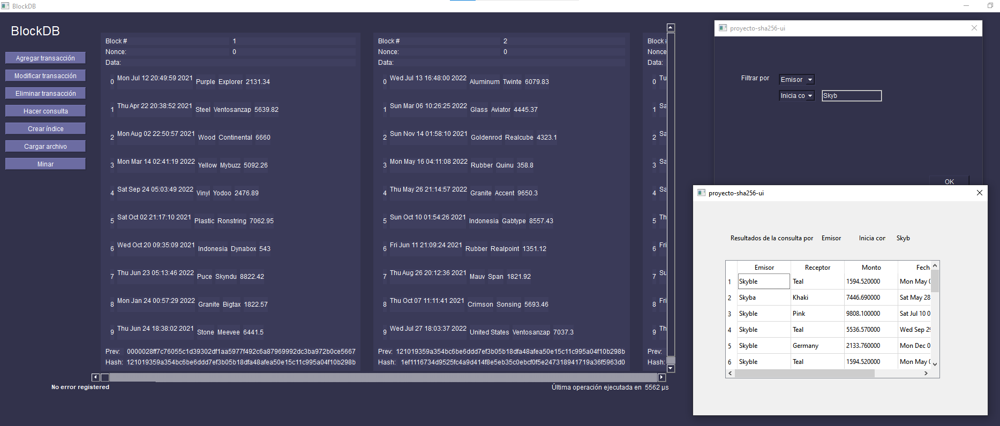                               |
|:----------------------------------------------------------------------------:|
| *Figura 9: Testeando sin índice la búsqueda inicia con Skyb sobre el emisor* |

|                      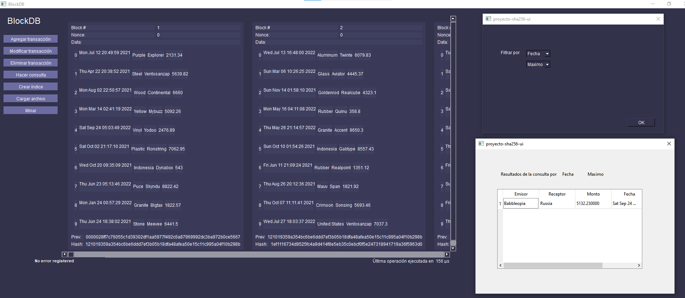                      |
|:-----------------------------------------------------------:|
| *Figura 10: Testeando el índice maxheap sobre fecha máxima* |

|                                                    |
|:-------------------------------------------------------------------:|
| *Figura 11: Testeando el índice hash sobre emisor igual a Explorer* |

|                                      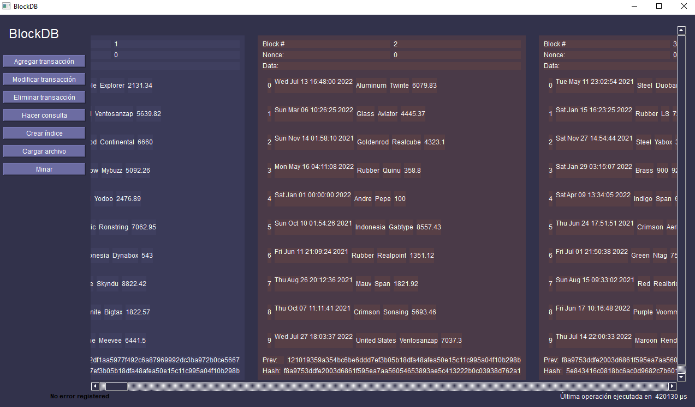                                       |
|                                     :-----------------:                                      |
| *Figura 12: Modificación de un registro en el Blockchain. Los bloques afectados se resaltan* |